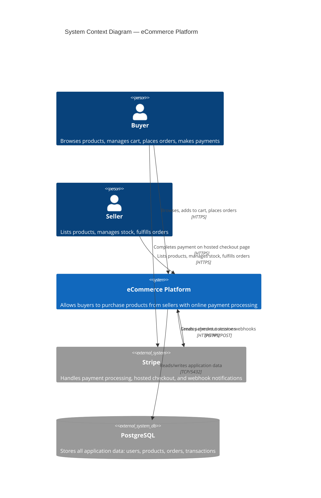
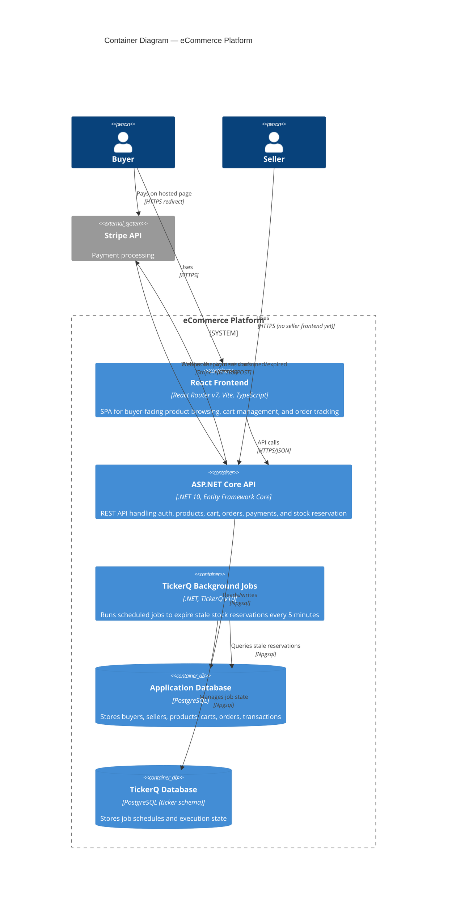
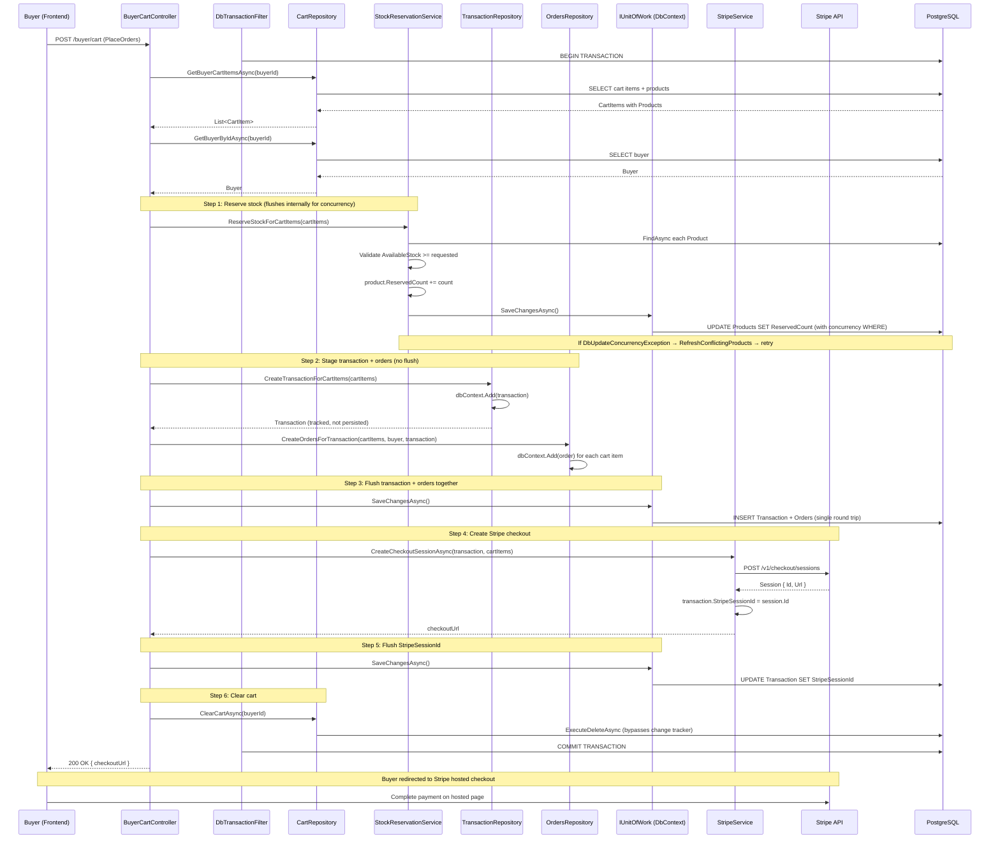
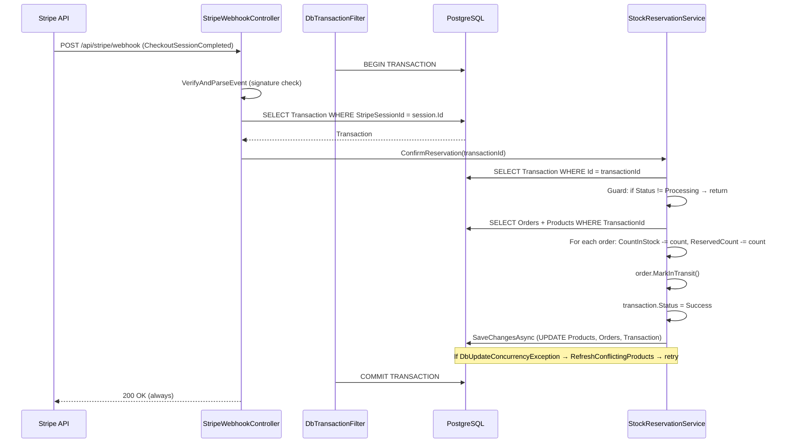
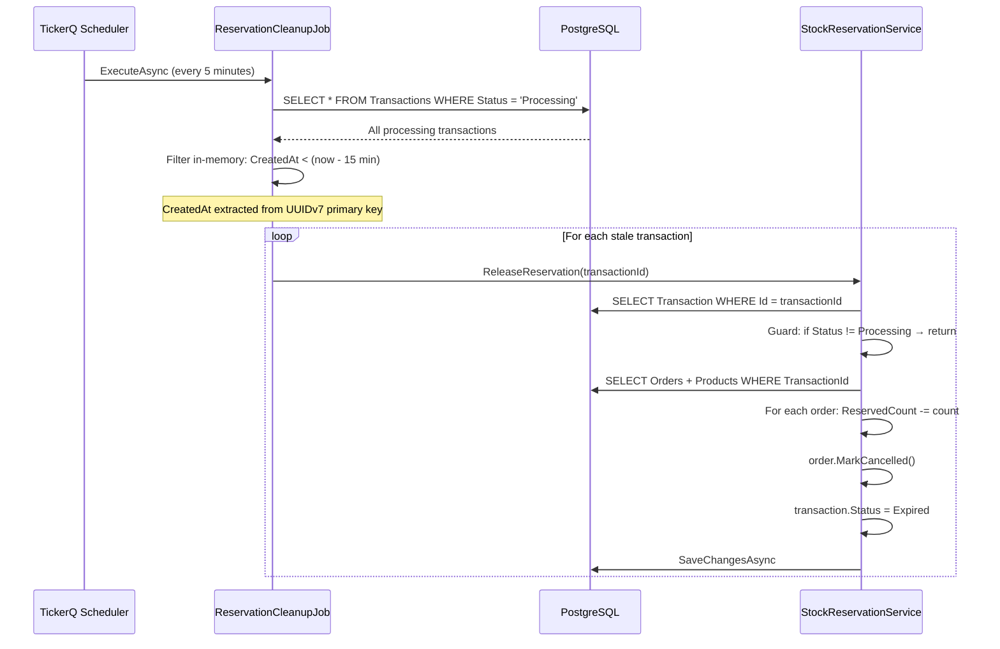
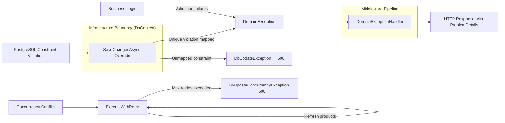

# C4 Architecture Documentation — eCommerce Platform

## Level 1: System Context Diagram

Shows the eCommerce system as a whole and its relationships with external actors and systems.



---

## Level 2: Container Diagram

Shows the major deployable units and how they communicate.



---

## Level 3: Component Diagram — Backend API

Shows the internal structure of the ASP.NET Core API container.

```mermaid
C4Component
    title Component Diagram — ASP.NET Core Backend

    Container_Boundary(api, "ASP.NET Core API") {

        Component(authCtrl, "AuthController", "[AllowAnonymous]", "Buyer/seller registration and JWT login")
        Component(buyerProductsCtrl, "BuyerProductsController", "[Authorize: Buyer]", "Browse listed products")
        Component(buyerCartCtrl, "BuyerCartController", "[Authorize: Buyer]", "Cart CRUD + PlaceOrders checkout flow")
        Component(buyerOrdersCtrl, "BuyerOrdersController", "[Authorize: Buyer]", "View order history")
        Component(sellerProductsCtrl, "SellerProductsController", "[Authorize: Seller]", "Product CRUD, stock management")
        Component(sellerOrdersCtrl, "SellerOrdersController", "[Authorize: Seller]", "View/update order status")
        Component(webhookCtrl, "StripeWebhookController", "[AllowAnonymous]", "Receives Stripe payment webhooks")

        Component(authRepo, "AuthRepository", "IAuthRepository", "Stages buyer/seller creation, validates credentials")
        Component(productRepo, "ProductsRepository", "IProductsRepository", "Stages product creation, queries by seller/listing")
        Component(cartRepo, "CartRepository", "ICartRepository", "Cart item CRUD, buyer lookup")
        Component(orderRepo, "OrdersRepository", "IOrdersRepository", "Stages order creation, queries with mandatory user filter")
        Component(txRepo, "TransactionRepository", "ITransactionRepository", "Stages transaction creation from cart totals")

        Component(stockSvc, "StockReservationService", "IStockReservationService", "Reserve/confirm/release stock with optimistic concurrency retry")
        Component(stripeSvc, "StripeService", "IStripeService", "Creates Stripe checkout sessions")
        Component(tokenSvc, "TokenService", "ITokenService", "Generates JWT access tokens")
        Component(currentUser, "CurrentUser", "ICurrentUser", "Extracts user ID and role from JWT claims")

        Component(dbContext, "ECommerceDbContext", "DbContext + IUnitOfWork", "EF Core context with exception translation override")
        Component(txFilter, "DbTransactionFilter", "IAsyncActionFilter", "Wraps mutating requests in a DB transaction")
        Component(exHandler, "DomainExceptionHandler", "IExceptionHandler", "Translates DomainExceptions to HTTP ProblemDetails")

        Component(cleanupJob, "ReservationCleanupJob", "TickerQ Function", "Expires stale reservations every 5 minutes")
    }

    ContainerDb_Ext(db, "PostgreSQL")
    System_Ext(stripe, "Stripe API")

    Rel(authCtrl, authRepo, "Stages entities")
    Rel(authCtrl, tokenSvc, "Generates JWT")
    Rel(authCtrl, dbContext, "SaveChangesAsync")

    Rel(buyerCartCtrl, cartRepo, "Cart operations")
    Rel(buyerCartCtrl, stockSvc, "Reserve stock")
    Rel(buyerCartCtrl, txRepo, "Stage transaction")
    Rel(buyerCartCtrl, orderRepo, "Stage orders")
    Rel(buyerCartCtrl, stripeSvc, "Create checkout")
    Rel(buyerCartCtrl, dbContext, "SaveChangesAsync")

    Rel(sellerProductsCtrl, productRepo, "Product operations")
    Rel(sellerProductsCtrl, dbContext, "SaveChangesAsync")

    Rel(sellerOrdersCtrl, orderRepo, "Query/update orders")
    Rel(sellerOrdersCtrl, dbContext, "SaveChangesAsync")

    Rel(webhookCtrl, stockSvc, "Confirm/release reservation")

    Rel(stockSvc, dbContext, "SaveChangesAsync (with retry)")
    Rel(stripeSvc, stripe, "Checkout Sessions API")
    Rel(cleanupJob, stockSvc, "Release expired reservations")

    Rel(dbContext, db, "Npgsql")

    Rel(txFilter, dbContext, "Begin/Commit/Rollback transaction")
    Rel(exHandler, authCtrl, "Catches DomainExceptions")
```



---

## Level 4: Key Flow — PlaceOrders Checkout Sequence

Shows the detailed interaction for the most critical business flow.



---

## Level 4: Key Flow — Stripe Webhook (Payment Confirmed)



---

## Level 4: Key Flow — Reservation Expiry (Background Job)



---

## Data Model (Entity Relationships)

```mermaid
erDiagram
    Buyer ||--|| Cart : "has one"
    Cart ||--o{ CartItem : "contains"
    CartItem }o--|| Product : "references"
    Product }o--|| Seller : "owned by"
    Order }o--|| Buyer : "placed by"
    Order }o--|| Seller : "fulfilled by"
    Order }o--|| Product : "for product"
    Order }o--|| Transaction : "paid via"

    Buyer {
        uuid Id PK "UUIDv7"
        string Name
        string Email UK
        string PasswordHash
        string Address
    }

    Seller {
        uuid Id PK "UUIDv7"
        string Name
        string Email UK
        string PasswordHash
        string BankAccountNumber
    }

    Product {
        uuid Id PK "UUIDv7"
        uuid SellerId FK
        string Sku
        string Name
        decimal Price "CHECK > 0"
        int CountInStock "CHECK >= 0, concurrency token"
        int ReservedCount "CHECK >= 0 AND <= CountInStock, concurrency token"
        string Description "nullable"
        string ImageUrl "nullable"
        bool IsListed
    }

    Cart {
        uuid Id PK "UUIDv7"
        uuid BuyerId FK_UK "one-to-one"
    }

    CartItem {
        uuid Id PK "UUIDv7"
        uuid CartId FK
        uuid ProductId FK
        int Count
    }

    Order {
        uuid Id PK "UUIDv7"
        uuid ProductId FK
        uuid BuyerId FK
        uuid SellerId FK
        uuid TransactionId FK
        int Count "CHECK > 0"
        decimal Total "CHECK >= 0"
        string Address
        string Status "enum: AwaitingPayment, InTransit, Delivered, Cancelled"
    }

    Transaction {
        uuid Id PK "UUIDv7"
        decimal Amount
        string Status "enum: Processing, Success, Failed, Expired"
        string StripeSessionId UK "nullable"
    }
```

---

## Exception Pipeline


